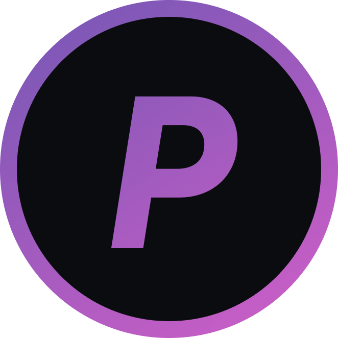

<!-- Improved compatibility of back to top link: See: https://github.com/othneildrew/Best-README-Template/pull/73 -->

<!--
*** Thanks for checking out the Best-README-Template. If you have a suggestion
*** that would make this better, please fork the repo and create a pull request
*** or simply open an issue with the tag "enhancement".
*** Don't forget to give the project a star!
*** Thanks again! Now go create something AMAZING! :D
-->

<!-- PROJECT SHIELDS -->
<!--
*** I'm using markdown "reference style" links for readability.
*** Reference links are enclosed in brackets [ ] instead of parentheses ( ).
*** See the bottom of this document for the declaration of the reference variables
*** for contributors-url, forks-url, etc. This is an optional, concise syntax you may use.
*** https://www.markdownguide.org/basic-syntax/#reference-style-links
-->

[![Stargazers][stars-shield]][stars-url]

<!-- PROJECT LOGO -->
 

  

<h3 align="center">Privote</h3>

  

    On-chain Private Voting Mechanism
     
    <a href="https://github.com/Privote-project"><strong>Explore the docs »</strong></a>
     
     
    <a href="https://ethglobal.com/showcase/privote-hertg">View Demo</a>
    ·
    <a href="https://github.com/Privote-project/issues/new?labels=bug&template=bug-report---.md">Report Bug</a>
    ·
    <a href="https://github.com/Privote-project/issues/new?labels=enhancement&template=feature-request---.md">Request Feature</a>
  

<!-- TABLE OF CONTENTS -->

  
Table of Contents

  <ol>
    <li>
      <a href="#about-the-project">About The Project</a>
      <ul>
        <li><a href="#built-with">Built With</a></li>
      </ul>
    </li>
    <li><a href="#constituents">Constituents</a></li>
    <li><a href="#problems-we-solve">Problems We Solve</a></li>
    <li><a href="#roadmap">Roadmap</a></li>
    <li><a href="#contributing">Contributing</a></li>
    <li><a href="#license">License</a></li>
    <li><a href="#contact">Contact</a></li>
    <li><a href="#acknowledgments">Acknowledgments</a></li>
  </ol>

<!-- ABOUT THE PROJECT -->

## About The Project

[![Product Name Screen Shot][product-screenshot]](https://github.com/PriVote-Project/.github/blob/main/profile/images/home.png)

Privote is a decentralized voting mechanism that allows users to vote on-chain in a private and secure manner. It uses [Maci](https://maci.pse.dev/) protocol made by PSE team to ensure that votes don't leak and are not tampered with. The project is open-source and anyone can contribute to it.
Privote enables users to create various types of private polls and vote on them. It also provides various types of auth mechanisms like Anon-Aadhar (aadhar based verification from India), WorldCoin-auth, NFC (can be used in IRL events like ethglobal hackathons), etc, enabling holding of various interesting polls without revealing the choice of voters.

(<a href="#readme-top">back to top</a>)

### Built With

- [![Next][Next.js]][Next-url]
- [![React][React.js]][React-url]
- [Hardhat](https://hardhat.org/)
- [Maci](https://maci.pse.dev/)
- [Chainlink](https://chain.link)

(<a href="#readme-top">back to top</a>)

<!-- Constituents -->

## Constituents

Privote is made up of the following components:

- **[Frontend](https://github.com/Privote-project/privote-frontend)** - The UI for Privote that allows users to create different types of polls and handle voting procedure smoothly.
- **[Maci-Docker](https://github.com/Privote-project/maci-docker)** - The docker image for the [Maci](https://maci.pse.dev/) protocol flow to publish votes easily. Users publishing votes from the frontend can use this docker image to publish votes in few commands.
  Privote deploys the Maci-Docker image on a server and uses it to provide users options to publish votes on-chain directly from the frontend.
- **[Contracts](https://github.com/Privote-project/privote-contracts)** - The smart contracts for Privote on which the whole voting mechanism is based. The contracts integrate
  - [Maci](https://maci.pse.dev/) - The protocol for private voting
  - [Chainlink](https://chain.link) - Uses Chainlink CCIP to enable usage of Privote from multiple chains.
  - [Anon-Aadhar](https://pse.dev/projects/anon-aadhaar) - Aadhar based verification for Indian users
  - [WorldCoin](https://worldcoin.org/) - WorldCoin based verification for global users
  - [NFC](https://en.wikipedia.org/wiki/Near-field_communication) - NFC based verification for IRL events like EthGlobal hackathons

<!-- USAGE EXAMPLES -->

## Problems We Solve

1. **On-chain Vote Visibility**:

- Problem: Traditional on-chain voting mechanisms expose voter choices publicly, which can lead to voter hesitance and resistance due to privacy concerns.
- Solution: We utilize the Maci protocol for private voting, ensuring that votes remain confidential and only the final tally is revealed.

2. **Lack of Ways to Avoid Bad Actors (Multiple Voting, etc.)**:

- Problem: Traditional on-chain voting mechanisms lack ways to prevent bad actors from voting multiple times or manipulating the voting process. People can create multiple wallets, etc, to dodge the system.
- Solution: We use various auth mechanisms like Anon-Aadhar, WorldCoin-auth, NFC, etc, to ensure that only legitimate users can vote as per the rules auth of organizers.

3. **Bribery and Coercion**:

- Problem: Traditional on-chain voting mechanisms are susceptible to bribery and coercion, as voters can be forced to reveal their choices as can be verified on-chain.
- Solution: With Privote, voters can vote privately, ensuring that their choices remain confidential and cannot be verified on-chain, leaving no incentive for bribers or coercers.

4. **Lack of Cross-chain Compatibility**:

- Problem: With advent of various L2s and other chains, chain limitation have got real, people having tokens on different chains can't interact with dapps on other chains.
- Solution: We use Chainlink CCIP to enable usage of Privote from multiple chains, enabling users to vote from any chain they have tokens on.

<!-- ROADMAP -->

## Roadmap

- <input disabled="" type="checkbox"> More Auth Mechanisms
  We will be integrating more on-chain authentication mechanisms like Open Passport to make the dApp more generic.

- <input disabled="" type="checkbox"> Further Plans
  Other Features: Make things more automated, UI more inclusive, etc.

- <input disabled="" type="checkbox"> Vote Without Wallet
  There may be a market for paid polling through this mechanism that allows users to directly vote with NFC, etc., without the need for funds.

See the [open issues](https://github.com/Privote-project/issues) for a full list of proposed features (and known issues).

(<a href="#readme-top">back to top</a>)

<!-- CONTRIBUTING -->

## Contributing

Contributions are what make the open source community such an amazing place to learn, inspire, and create. Any contributions you make are **greatly appreciated**.

If you have a suggestion that would make this better, please fork the repo and create a pull request. You can also simply open an issue with the tag "enhancement".
Don't forget to give the project a star! Thanks again!

1. Fork the Project
2. Create your Feature Branch (`git checkout -b feature/AmazingFeature`)
3. Commit your Changes (`git commit -m 'Add some AmazingFeature'`)
4. Push to the Branch (`git push origin feature/AmazingFeature`)
5. Open a Pull Request

(<a href="#readme-top">back to top</a>)

<!-- LICENSE -->

## License

Distributed under the MIT License. See `LICENSE.txt` for more information.

(<a href="#readme-top">back to top</a>)

<!-- CONTACT -->

## Contact

Your Name - [@lordforever](https://twitter.com/lordforever) - shashanktrivedi1917.com

Project Link: [https://github.com/Privote-project](https://github.com/Privote-project)

(<a href="#readme-top">back to top</a>)

<!-- ACKNOWLEDGMENTS -->

## Acknowledgments

We extend our deepest gratitude to the mentors from EthSingapore, Maci, Chainlink, Worldcoin, and all the other organizations who generously shared their time, expertise, and guidance throughout this journey. Your support was invaluable in helping us navigate challenges, refine our ideas, and ultimately bring this project to fruition.

Thank you for inspiring us and pushing us to reach our full potential. We are truly grateful for the opportunity to have learned from such talented and passionate individuals.

(<a href="#readme-top">back to top</a>)

<!-- MARKDOWN LINKS & IMAGES -->
<!-- https://www.markdownguide.org/basic-syntax/#reference-style-links -->

[contributors-shield]: https://img.shields.io/github/contributors/Privote-project.svg?style=for-the-badge
[contributors-url]: https://github.com/Privote-project/graphs/contributors
[forks-shield]: https://img.shields.io/github/forks/Privote-project.svg?style=for-the-badge
[forks-url]: https://github.com/Privote-project/network/members
[stars-shield]: https://img.shields.io/github/stars/Privote-project.svg?style=for-the-badge
[stars-url]: https://github.com/Privote-project/stargazers
[issues-shield]: https://img.shields.io/github/issues/Privote-project.svg?style=for-the-badge
[issues-url]: https://github.com/Privote-project/issues
[license-shield]: https://img.shields.io/github/license/Privote-project.svg?style=for-the-badge
[license-url]: https://github.com/Privote-project/blob/master/LICENSE.txt
[linkedin-shield]: https://img.shields.io/badge/-LinkedIn-black.svg?style=for-the-badge&logo=linkedin&colorB=555
[linkedin-url]: https://linkedin.com/in/linkedin_username
[product-screenshot]: images/home.png
[Next.js]: https://img.shields.io/badge/next.js-000000?style=for-the-badge&logo=nextdotjs&logoColor=white
[Next-url]: https://nextjs.org/
[React.js]: https://img.shields.io/badge/React-20232A?style=for-the-badge&logo=react&logoColor=61DAFB
[React-url]: https://reactjs.org/
[Vue.js]: https://img.shields.io/badge/Vue.js-35495E?style=for-the-badge&logo=vuedotjs&logoColor=4FC08D
[Vue-url]: https://vuejs.org/
[Angular.io]: https://img.shields.io/badge/Angular-DD0031?style=for-the-badge&logo=angular&logoColor=white
[Angular-url]: https://angular.io/
[Svelte.dev]: https://img.shields.io/badge/Svelte-4A4A55?style=for-the-badge&logo=svelte&logoColor=FF3E00
[Svelte-url]: https://svelte.dev/
[Laravel.com]: https://img.shields.io/badge/Laravel-FF2D20?style=for-the-badge&logo=laravel&logoColor=white
[Laravel-url]: https://laravel.com
[Bootstrap.com]: https://img.shields.io/badge/Bootstrap-563D7C?style=for-the-badge&logo=bootstrap&logoColor=white
[Bootstrap-url]: https://getbootstrap.com
[JQuery.com]: https://img.shields.io/badge/jQuery-0769AD?style=for-the-badge&logo=jquery&logoColor=white
[JQuery-url]: https://jquery.com
